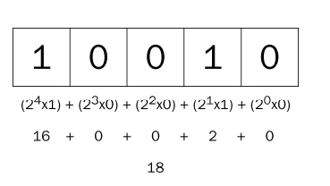
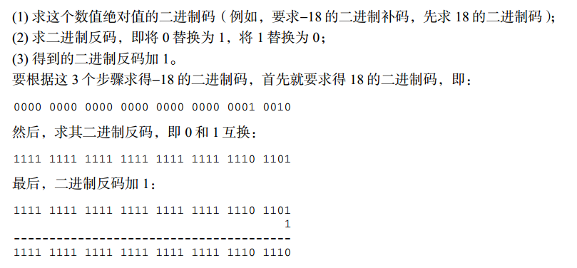
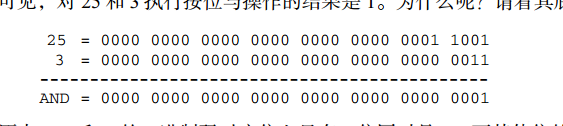
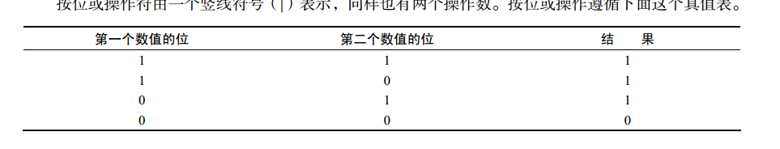
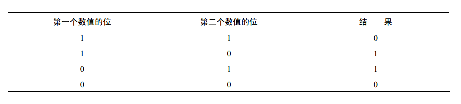

# chapter 3 基本概念

## 语法

###  区分大小写

    不能使用标识符命名

### 标识符

    - 第一个字符必须是字母、下划线或美元字符
    - 其他字符可以是字母、下划线、美元符号或数字
    - 采用驼峰大小写格式，第一个字母小写，其他大写

### 注释

```js
// 单行注释

/*
 * 多行注释
 */
```

### 严格模式

```js
"use strict"
```

```js
function doSomething() {
  "use strict"
}
```

### 语句

- 分号不省略
- 一句判断也要加括号

## 关键字和保留字

## 变量

`ECMAScript`的变量是松散类型，可以用来保存任何类型的数据

`var`操作符定义的变量将成为定义该变量的作用域中的局部变量，如果在函数中使用 `var`定义一个变量，变量在函数退出后会被销毁

省略`var`操作符可以定义全局变量，不推荐，给未声明的变量在严格模式下会导致跑出`ReferenceError`的错误

## 数据类型

- Undefined
- null
- Boolean
- number
- String
- Object

Object本质上是一组无序的名值对组成的

### typeof操作符

**typeof** 是操作符不是函数不需要括号，返回的类型都是`字符串`

### undefined 

`var` 声明变量但未对其加以初始化，就是`undefined`

但是用typeof 弹出，它们都是 `undefined`

不存在需要显式的吧一个变量设置为`undefined`

```js
var message;

console.log(1,message); // "undefined"
console.log(1,age);  // 弹出错误

console.log(2, typeof message);  // "undefined"
console.log(2, typeof age)  // "undefined"
```

### Null 空对象指针

如果定义的变量准备将来用于保存对象，可以初始化为`null`
```js
var car = null;
console.log(typeof car); // "object"
console.log(null == undefined) // true
```
### Boolean 类型

字面量`true`和 `false`区分大小写

`Boolean()`可以区分大小写

### number 类型

支持十进制、八进制、十六进制
八进制第一位必须是0,严格模式下抛出错误
十六进制前两位必须是0x
极大极小的数字可以用 `e`表示
浮点数的运算不能作为判断的依据会产生误差
 `isFinite()`可以判断一个函数是不是有穷的
 `NaN`非数值，涉及它的操作都返回NAN，且与任何值都不相等
 `isNaN()` 判断不是数值
 
```js
console.log(isNaN(NaN))   // true
console.log(isNaN(10))  // false
```
 
`Number()`、`parseInt()`、`parseFloat()` 可以把非数值转为数值
 
 `Number()` 无法转换八进制和十六进制
 
```js
console.log(Number('00000001')) // 1
console.log(Number('123blur')) //NAN
```
 
 再处理整数的时候通常使用 `parseInt()`,可以将八进制和十六进制转换，第二个参数是转换的基数
 
```js
console.log(parseInt('000001'))
console.log(parseInt('123blur')) 
```
 
`parseFloat()`解析到遇见一个无效的浮点字符或到末尾，只支持十进制
 
 
 ### string
 
 一些特殊的字面量（转义符）
 
`\n` 换行
`\t` 制表
`\b` 空格
`\r` 回车

`length`可以获取任何字符串的长度

`toString()`把值转换为字符串 支持布尔、数值、对象、字符串，它的参数可以输出的基数,不能转换null或undefined

```js
var num = 10;
console.log(num.toString());  //'10'
console.log(num.toString(2)); // '1010'
```

`String()`可以转换不知道值是不是null或undefined


### Object

```js
var o = new Object();
```
 Object是所有实例的基础，Object具有的任何属性和方法存在更具体的对象中
 
 - `constructor` 保存用于创建当前对象的函数
 - `hasOwnProperty(propertyName)` 用于检出给定的属性实在当前对象的实例中而不是在实例原型中  `o.hasOwnProperty('name')`
 - `isPrototypeOf(object)` 用于检查传入对象是否是是传入对象的原型
 - `propertyIsEnumerable(properName)` 用于检查给定的属性是否能够使用 `for in` 和 `hasOwnProperty`一样参数必须是字符串
 - `toLocaleString()` 返回对象的字符串表示该字符串与执行环境的地区对应
 - `toString()` 返回对象的字符串表示
 - `valueOf()` 返回对象的字符串、数值布尔值与 `toString()`方法相同
 
## 操作符
 
 `+` 先对值像 `Number()` 转换
 
```js
console.log(+true); // true
console.log(+'z');  // NaN
```
 
 `-` 与加相似

```js
console.log(-true); // -1
console.log(-false); // -0
console.log(-'z');  // NaN
```

### 位操作

;

;


- 按位非 

返回数值的反码,相当于负数减1
```js
var num4 = 25;
console.log(~num4);  // 26
```
~00000000000000000000000000001001
=11111111111111111111111111110110
~9 = -10
- 按位与

;
001 
&　
011 
=
001

1&3 = 1

```js
console.log( 25 & 3) //1
```

- 按位或

;

001 
|
011 
=
011

1&3 = 3


- 按位异或

;
相等的转为0，不相等的转为1

001 
^
011 
=
010

- 左移 `<<`

```js
console.log(2 << 5); // 64  相当于2*2*2*2*2*2
```
不影响操作的符号位 -2 向左移5位，结果是-64

- 有符号右移 `>>`

```js
console.log(64 >> 5); // 2 相当于64/2/2/2/2/2
```

- 无符号的右移 `>>>` 对于正数来说都一样，对于负数就是补码的形势进行

```js
console.log(-64 >> 5); // -2
console.log(-64 >>> 5); //134217726
```

### 布尔操作符  p44

- `!` 取反
- `!!` 也就是模拟 `Boolean()`
- `&&` 属于短路操作，如果第一个操作能决定结果，不会对第二个操作
```js
console.log(['1', '2'] && ['3', '4']); // [3,4]
console.log( false && someValue) //没有定义的变量不会报错
```
两个数都输对象返回第二个对象

- `||` 也属于短路操作，可以用来避免null或者undefined

- `*` 乘
```js
console.log(0 * Infinity); // NaN
console.log('a' * Infinity); // Infinity -Infinity
```
两个数都是对象返回第一个

- `/` 除
如果一个值是NaN,结果也是NaN
```js
console.log(0 / 0); // NaN
console.log(Infinity / Infinity); // NaN
console.log(Infinity / 0); // Infinity
```
- '%' 取模
```js
console.log(Infinity % 0); // NaN
```
- '+' 加
如果操作数中其中有一个是字符串，就拼接起来
```js
console.log(Infinity + -Infinity); //NaN
```

- `-` 减
如果一个操作数是字符、布尔、null或undefined在后台会调用 `Number()`函数，将其转为数值

### 关系操作符

如果是字符串，会比较字符编码值。字符编码中小写字母的值大于 大写字母的值
如果是对象会调用 `valueOf()`或`toString()`方法
当其中有个操作数是数字，将会对另一个操作数进行转换

```js
console.log('23' < '3'); //true 因为3的字符串编码是51，2是50
console.log('a' < 3); // false
```

NaN参与的比较中都是false p52

`==` 判断操作数相等，操作时会先转换操作数（强制转型），再判断是否相等
`===` 不会转换操作直接判断（推荐）

### 条件操作符

```js
var able = boolean_expression ? true_value : false_value
```

### 逗号操作符

逗号操作符总会返回表达式最后一项
```js
console.log((5, 1, 4, 0)); // 0
```

## 语句

### if 语句

推荐的语法

```js
if (i > 5) {
    console.log(5);
} else if ( i < 0) {
    console.log(0);
} else {
    console.log('other');
}
```

### do-while 语句

先执行后判断的循环，所以循环至少执行一次

```js
var i = 0;
do {
    i += 2;
} while (i < 0);
console.log(i); // 2
```

### while 语句

先判断后执行，前测试循环语句

```js
var i = 0;
while(i < 10) {
   i += 2; 
}
```

### for语句

也是前测试循环语句

```js
for(;;) {
    
} // 无限循环
```

循环中的i,在外部也可以调用

### for in 语句

精准的迭代语句，用来枚举对象的属性
```js
for(var propName in window ) {
    document.write(propName);
}
```
通过for...in 循环输出的顺序是不可预测的，根据浏览器而异
建议在for...in 循环前检验对象的值是不是空

### break和continue语句

`break`语句会立即退出循环，强制继续执行循环后面的语句
`continue`立即退出循环，退出后从会从循环的顶部继续执行

`break` 和 `continue` 语句都可以与 `label` 语句联合使用,有了`label` break可以直接跳出到最外层循环，如果没有label它只能跳出一层循环

```js
var num5 = 0;
outermost:
    for (var i=0; i < 10; i++) {
        for (var j=0; j < 10; j++) {
            if (i == 5 && j == 5) {
                break outermost;
            }
            num5++;
        }
    }
console.log(num5); //55
```
### with 语句

`with`语句是将代码作用域设置到特定的对象中，主要为了简化多次编写同一个对象的工作
由于 `with`导致语句性能下降，不建议使用

### switch 语句

```js
switch (expression) {
    case value: statement
     break
    case value: statement
     break;
    default: statement
}
```
如果省略`break`关键字就会导致执行当前 `case`后再执行下一个 `case`。 `default`关键字用于表达不匹配前面任何一种的情况，相当于 `else`语句

每个`case`的值不一定是常量，也可以是变量或者表达式

`switch`在比较值时使用的是全等操作符

## 函数

函数会在执行完 `return`语句之后停止并立即退出，`return`不带值返回 `undefined`

### 理解参数

函数不介意传递进来多少个参数和参数类型
函数体通过 `argument`对象来访问这个参数数组，从而获取传递给函数的每一个参数
命名的参数是提供方便，不是必须的
`argument`可以和命名参数一起使用，它们访问的内存空间是独立的
严格模式下不能对 `argument`进行赋值

### 没有重载

如果定义两个相同名字的函数，该名字只属于后定义的函数