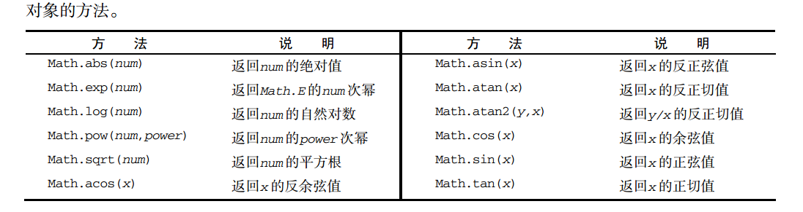

# chapter 3 基本概念

## 语法

- 区分大小写

- 标识符

    - 第一个字符必须是字母、下划线或美元字符
    - 其他字符可以是字母、下划线、美元符号或数字
    - 采用驼峰大小写格式，第一个字母小写，其他大写

- 切换到严格模式
```js
"use strict"
```

- 分号不省略，即使是一句判断也要加括号

## 关键字和保留字

## 变量

ECMAScript的变量时松散类型，可以用来保存任何类型的数据

`var`操作符定义的变量将成为定义该变量的作用域中的局部变量，如果在函数中使用 `var`定义一个变量，变量在函数退出后会被销毁

省略`var`操作符可以定义全局变量，不推荐，给未声明的变量在严格模式下会导致跑出ReferenceError的错误

## 数据类型

undefined\null\boolean\number\string\object

object本质上是一组无序的名值对组成的

**typeof** 是操作符不是函数不需要括号，返回的类型都是字符串 

### undefined 没有初始化的值

声明和尚未声明的变量`console`声明的是`undefine`没有声明的直接警告

但是用typeof 弹出，它们都是 `undefined`

```js
var message;

console.log(1,message); // undefined
console.log(1,age);  // 弹出错误

console.log(2, typeof message);  // undefined
console.log(2, typeof age)  // undefined
```

### Null 空对象指针

```js
var car = null;
console.log(typeof car); // "object"
console.log(null == undefined) // true
```
### Boolean 类型

字面量`true`和 `false`区分大小写

`Boolean()`可以区分大小写

### number 类型

支持十进制、八进制、十六进制
八进制第一位必须是0,严格模式下抛出错误
十六进制前两位必须是0x
极大极小的数字可以用 `e`表示
浮点数的运算不能作为判断的依据会产生误差
 `isFinite()`可以判断一个函数是不是有穷的
 `NaN`非数值，涉及它的操作都返回NAN，且与任何值都不相等
 `isNaN()` 判断不是数值
 
```js
console.log(isNaN(NaN))   // true
console.log(isNaN(10))  // false
```
 
`Number()`、`parseInt()`、`parseFloat()` 可以把非数值转为数值
 
 `Number()` 无法转换八进制和十六进制
 
```js
console.log(Number('00000001')) // 1
console.log(Number('123blur')) //NAN
```
 
 再处理整数的时候通常使用 `parseInt()`,可以将八进制和十六进制转换，第二个参数是转换的基数
 
```js
console.log(parseInt('000001'))
console.log(parseInt('123blur')) 
```
 
`parseFloat()`解析到遇见一个无效的浮点字符或到末尾，只支持十进制
 
 
 ### string
 
 一些特殊的字面量（转义符）
 
`\n` 换行
`\t` 制表
`\b` 空格
`\r` 回车

`length`可以获取任何字符串的长度

`toString()`把值转换为字符串 支持布尔、数值、对象、字符串，它的参数可以输出的基数,不能转换null或undefined

```js
var num = 10;
console.log(num.toString());  //'10'
console.log(num.toString(2)); // '1010'
```

`String()`可以转换不知道值是不是null或undefined


### Object

```js
var o = new Object();
```
 Object是所有实例的基础，Object具有的任何属性和方法存在更具体的对象中
 
 - `constructor` 保存用于创建当前对象的函数
 - `hasOwnProperty(propertyName)` 用于检出给定的属性实在当前对象的实例中而不是在实例原型中  `o.hasOwnProperty('name')`
 - `isPrototypeOf(object)` 用于检查传入对象是否是是传入对象的原型
 - `propertyIsEnumerable(properName)` 用于检查给定的属性是否能够使用 `for in` 和 `hasOwnProperty`一样参数必须是字符串
 - `toLocaleString()` 返回对象的字符串表示该字符串与执行环境的地区对应
 - `toString()` 返回对象的字符串表示
 - `valueOf()` 返回对象的字符串、数值布尔值与 `toString()`方法相同
 
## 操作符
 
 `+` 先对值像 `Number()` 转换
 
```js
console.log(+true); // true
console.log(+'z');  // NaN
```
 
 `-` 与加相似

```js
console.log(-true); // -1
console.log(-false); // -0
console.log(-'z');  // NaN
```

### 位操作

;

;


- 按位非 

返回数值的反码,相当于负数减1
```js
var num4 = 25;
console.log(~num4);  // 26
```

- 按位与

;

```js
console.log( 25 & 3) //1
```

- 按位或

;

console.log( 25 | 3)

- 按位异或

;

- 左移 `<<`

```js
console.log(2 << 5); // 64
```
不影响操作的符号位 -2 向左移5位，结果是-64

- 有符号右移 `>>`

```js
console.log(64 >> 5); // 2
```

- 无符号的右移 `>>>` 对于正数来说都一样，对于负数就是补码的形势进行

```js
console.log(-64 >> 5); // -2
console.log(-64 >>> 5); //134217726
```

### 布尔操作符  p44

- `!` 取反
- `!!` 也就是模拟 `Boolean()`
- `&&` 属于短路操作，如果第一个操作能决定结果，不会对第二个操作
```js
console.log(['1', '2'] && ['3', '4']); // [3,4]
console.log( false && someValue) //没有定义的变量不会报错
```
两个数都输对象返回第二个对象

- `||` 也属于短路操作，可以用来避免null或者undefined

- `*` 乘
```js
console.log(0 * Infinity); // NaN
console.log('a' * Infinity); // Infinity -Infinity
```
两个数都是对象返回第一个

- `/` 除
如果一个值是NaN,结果也是NaN
```js
console.log(0 / 0); // NaN
console.log(Infinity / Infinity); // NaN
console.log(Infinity / 0); // Infinity
```
- '%' 取模
```js
console.log(Infinity % 0); // NaN
```
- '+' 加
如果操作数中其中有一个是字符串，就拼接起来
```js
console.log(Infinity + -Infinity); //NaN
```

- `-` 减
如果一个操作数是字符、布尔、null或undefined在后台会调用 `Number()`函数，将其转为数值

### 关系操作符
如果是字符串，会比较字符编码值。字符编码中小写字母的值大于 大写字母的值
如果是对象会调用 `valueOf()`或`toString()`方法
当其中有个操作数是数字，将会对另一个操作数进行转换

```js
console.log('23' < '3'); //true 因为3的字符串编码是51，2是50
console.log('a' < 3); // false
```

NaN参与的比较中都是false p52

`==` 判断操作数相等，操作时会先转换操作数（强制转型）
