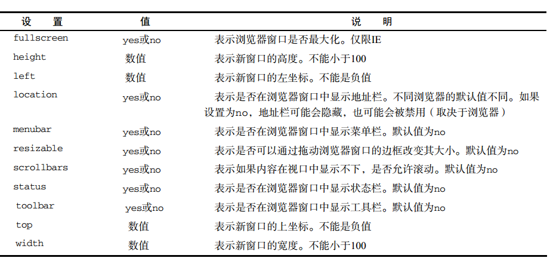

# BOM

`BOM`提供了很多对象用于访问浏览器的功能，与网页无关

## window对象

`window`浏览器的一个实例

### 全局作用域

`window`同时扮演者`ECMAScript`中 `Global`对象的角色

定义全局变量 与在 `window`对象上直接定义属性是有差别的
全局变量不能通过 `delete`操作符删除，而`window`对象上定义的属性可以,而根据测试目前已经一致都可以删除

```js
var age = '28';
window.color = 'red';

delete window.age;
delete window.color;

console.log(window.age); // undefined
console.log(window.color); //undefined
```

尝试访问未声明的变量会抛出错误，通过查询 `window`对象，可以知道这个未声明的是否存在，没有就是 `undefined`
```js
var newValue = oldValue; // 这里直接回报错
var newValue = window.oldValue; // 而通过window查询，可以确认声明是否存在，没有就是undefined
console.log(newValue);
```

不能 `window.prototype` 应该直接在`window`对象上创建新的属性和方法

### 间歇调用和超时调用

`js`是单线程语言，前者是在指定的时间后执行代码，后者则是在每隔指定的事件执行一次代码

`setTimeout()`超时调用，接收两个参数，要执行的代码和以毫秒表示的时间

```js
setTimeout(function() {
  console.log('hello world')
}, 1000)
```

这些任务会按照他们添加到对垒的顺序执行，第二个参数告诉多长时间把当前任务添加到队列中，如果是空的直接添加，如果不是空的，等前面的代码执行完添加

调用`setTimeout()`返回一个数值ID，表示超时调用，要取消尚未执行的超时调用，可以用`clearTimeout()`将相应的超时调用ID作为参数传递给它

```js
var timer = setTimeout(function() {
  console.log('hello world');
}, 1000);

clearTimeout(timer);  // 结果跟什么没有发生一样
```

超时调用的代码在全局作用域中执行，函数中的this在非严格指向 `window`，严格模式指向 `undefined`

`setInterval()`间隔调用，指定的事件间隔重复执行代码

```js
setInterval(function() {
  console.log('hello world');
}, 10000)
```

`setInterval()`同样返回间隔调用ID，通过`clearInterval()`来取消，它的作用比超时调用要重要

```js
var num = 0;
var max = 10;
var intervalId = null;

function incrementNumber() {
    num++;
    console.log(num);
    if(num === max) {
        clearInterval(intervalId);
        console.log('done');
    }
}

intervalId = setInterval(incrementNumber, 500);
```
使用超时调用，没有必要跟踪超时调用的ID，调用后自动停止，使用超时调用来模拟间歇调用是一种最佳模式，最好不要使用间歇调用
```js
var num1 = 0;
var max1 = 10;
function incrementNumber1() {
    num1++;
    console.log(num1);
    if(num1 < max1) {
        setTimeout(incrementNumber1, 500)
    } else {
        console.log('done');
    }
}

setTimeout(incrementNumber1, 500);

```

### 系统对话框

`alert()`、`confrim()`、`prompt()`可以调用系统对话框想用户显示消息

显示这些对话框，代码停止执行，关掉时恢复

- `alert()` 警告的对话框

- `confirm()`向用户确认，可以检查 `confrim()`方法返回的布尔值，true表示单击ok,false表示单击取消或者右上角的X

```js
if(confirm('Are you sure?')) {
    console.log('so glad you sure');
} else {
    console.log('you not sure');
}
```
;


- `prompt()`提示框 接收两个参数，要显示给用户的文本提示和文本输入域的默认值
```js
var result = prompt('what is your name?');
if(result !== null) {
    console.log('welcome' + result);
}
```

;

`window.print()` 显示打印对话框

`window.find()` 显示查找对话框

以上两种不会再对话框中的操作给出任何信息，他们的用处有限，不受用户禁用后后续对话框的显示

## location对象

它提供了当前窗口中加载的文档有关信息，是一个很特别的对象，是`window`对象也是`document`对象

```js
window.location == document.location // 引用同一个对象
```

属性名 | 例子 | 说明
----|------|----
hash | '#contents'  | 返回URL中hash(#号后跟零个或多个字符)，没有返回空字符
host | 'www.baidu.com:80'  | 返回服务器名称和端口号
hostname | 'www.baidu.com'  | 返回不带端口号的服务器名称
href | 'http://www.baidu.com' | 返回当前加载页面的完整URL，location.toString()也返回这个值
pathname | '/willeryCDA' | 返回URL中的目录和文件名
port | '8080' | 返回URL中指定的端口号，如果没有端口，返回空字符串
protocol | 'http:' | 返回页面使用的协议http或https
search | '?q=javascript' | 返回URL查询字符串，字符串以问号开头


### 查询字符串参数

```js
function getQueryStringArgs() {
    
    var qs = (location.search.length > 0 ? location.search.substring(1) : ''),
        args = {},
        items = qs.length ? qs.split('&') : [],
        item = null,
        name = null,
        value = null,
        len = items.length;
    for (var i = 0; i < len; i++) {
        item = items[i].split('=');
        name = decodeURIComponent(item[0]);
        value = decodeURIComponent(item[1]);

        if(name.length) {
            args[name] = value;
        }
    }

    return args;
}
// 假设 location.search = '?q=javascript&num=10';
var args = getQueryStringArgs();
console.log(args['q'],22); // 'javascript'
console.log(args['num']); // '10'
```

### 位置操作

```js
location.assign('http://baidu.com');
window.location('http://baidu.com');
location.href('http://baidu.com'); // 最常用
```

以上方法都可以立即打开新URL，在浏览器生成一条记录


也可以通过修改`hash`、`search`、`pathname`和 `port`来改变`URL`

任何一种修改，浏览器的历史记录都会生成一条记录
要禁用这种行为可以使用 `replace（）`调用后，用户不能回到前一个页面

```js
location.replace('www.baidu.com');
```

`reload()` 重新加载当前显示页面，如果要从服务器重新加载，需传参数`true`

```js
location.reload(); // 重新加载（缓存加载）
location.reload(true); // 重新加载（服务器加载）
```

## navigator对象