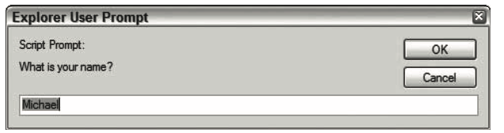

# BOM

`BOM`提供了很多对象用于访问浏览器的功能，与网页无关

## window对象

`window`浏览器的一个实例

### 全局作用域

`window`同时扮演者`ECMAScript`中 `Global`对象的角色

定义全局变量 与在 `window`对象上直接定义属性是有差别的
全局变量不能通过 `delete`操作符删除，而`window`对象上定义的属性可以,而根据测试目前已经一致都可以删除

```js
var age = '28';
window.color = 'red';

delete window.age;
delete window.color;

console.log(window.age); // undefined
console.log(window.color); //undefined
```

尝试访问未声明的变量会抛出错误，通过查询 `window`对象，可以知道这个未声明的是否存在，没有就是 `undefined`
```js
var newValue = oldValue; // 这里直接回报错
var newValue = window.oldValue; // 而通过window查询，可以确认声明是否存在，没有就是undefined
console.log(newValue);
```

不能 `window.prototype` 应该直接在`window`对象上创建新的属性和方法


### 窗口关系及框架

每个框架都拥有自己的 `window`对象，保存在`frame`集合中

可以使用

`window.frames[0]`或者 `topFrame`为`frame`的名字 `wondow.frames['topFrame'']`

`top`对象始终指向最高层的框架，也就是浏览器窗口
最好使用`top`来指向框架，也就是浏览器窗口

```js
window.frames[0]
window.frames['topFrame']
top.frames[0]
top.frames['topFrame']
frames[0]
frames['topFrame']
```

与 `top`相对的另一个window对象是 `parent`, 对象始终指向当前框架的直接上层框架

在没有框架的情况`parent`一定等于`top`,它们都等于 `window`

```html
<html>
<head>
<title>Frameset Example</title>
</head>
<frameset rows="100,*">
<frame src="frame.htm" name="topFrame">
<frameset cols="50%,50%">
<frame src="anotherframe.htm" name="leftFrame">
<frame src="anotherframeset.htm" name="rightFrame">
</frameset>
</frameset>
</html>

```
rightFrame中又包含

```html
<html>
<head>
<title>Frameset Example</title>
</head>
<frameset cols="50%,50%">
<frame src="red.htm" name="redFrame">
<frame src="blue.htm" name="blueFrame">
</frameset>
</html>
```

浏览器加载完第一个框架后，会加载第二个框架 `rightFrame`


除非用 `window.open()`打开，否则`window`对象的`name`属性不包含任何值

`self`对象始终指向`window`,`self`和`window`对象可以互换使用

每个 `window`都包含原生类型的构造函数，每个框架都有一套自己的构造函数，这些构造函数一一对象但是并不相等

### 窗口位置

```js
var leftPos = (typeof window.screenLeft == 'number') ? window.screenLeft:window.screenX;
var topPos = (typeof window.screenTop == 'number') ?　window.screenTop:window.screenY;
```

保存从屏幕左边和上边到`window`对象表示的页面可见区域的距离

`moveTo()`接收新位置的x和y坐标轴
`moveBy()`接收水平和垂直方向上移动的像素数

```js
window.moveTo(0,0) // 窗口移到屏幕左上角
window.moveBy(0, 100) // 窗口向下移动100像素
```

这两个方法可能会被浏览器禁用


### 窗口大小

`innerWidth`和`innerHeight`表示容器中页面视图的大小，减去边框宽度
`outerWidth`和`outerHeight`表示浏览器窗口本身的尺寸

`document.documentElement.clientWidth`和 `document.documentElement.clientHeight`保存了页面视口的信息
如果是混杂模式前面的前缀是 `document.body`

`document.compateMode`为 `CSS1Compat`标准模式

```js
var pageWidth = window.innerWidth,
    pageHeight = window.innerHeight;

if(typeof pageWidth != 'number') {
    if(document.compatMode == 'CSS1Compat') {
        pageWidth = document.documentElement.clientWidth;
        pageHeight = document.documentElement.clientHeight;
    } else {
        pageWidth = document.body.clientWidth;
        pageHeight = document.body.clientHeight;
    }
}

console.log(pageWidth, pageHeight);
```

`resizeTo()`接收浏览器窗口的新宽度和高度
`resizeBy()`接收新窗口与原窗口的宽度和高度之差

```js
window.resizeTo(100,100); // 调整到100*100
window.resizeBy(100, 50); // 调整到200*150
```

### 导航和打开窗口

使用 `window.open()`方法既可以导航到特定的URL，并打开一个新的浏览器窗口

接收四个参数： 要加载的URL,窗口目标，一个特性字符串以，一个表示新页面是否取代浏览器历史记录中当前加载页面的布尔值

```js
window.open('http://www.baidu.com', 'topFrame')
```

如果有一个名为 `topFrame`的窗口或框架，就会在这里面加载URL，否则会创建一个新窗口命名为 `topFrame`

第二个参数还可以是 `_self`、`_parent`、`_top`、`_blank`

- 弹出窗口

如果没有传第三个参数默认打开新的浏览器窗口


```js
window.open('http://www.baidu.com', 'baidu', 'height=400,widht=400,top=10,left=10,resizable=yes')
```

操作

```js
var may = window.open('http://www.baidu.com', 'baidu', 'height=400,widht=400,top=10,left=10,resizable=yes')
may.resizeTo(500, 500); // 调整大小
may.moveTo(100,100); //移动到
may.close() // 关闭
```

`close()`关闭窗口，关闭成功返回true,也可以调用 `top.close()`

`window`对象有个`opener`保存着打开他的原始窗口对象

```js
var may = window.open('http://www.baidu.com', 'baidu', 'height=400,widht=400,top=10,left=10,resizable=yes');
console.log(may.opener == window); //true
```
原始窗口中并没有指针指向弹出窗口

如果弹出的窗口不需要彼此之间通信,联系一旦切断，将没有办法恢复

```js
may.opener = null;
```

- 安全限制

IE会解除弹出窗口的某些限制，但是服务器上执行会对弹窗有所限制

- 弹出窗口屏蔽程序

大多数浏览器都内置弹出窗口屏蔽程序，如果内置的屏蔽程序阻止的弹出窗口`window.open()`返回`null`

```js
var may = window.open('http://www.baidu.com', '_blank');
if(may == null) {
    console.log('the popup was blocked');
}
```

如果是浏览器扩展或者其他程序阻止的弹窗，应该封装在 `try-catch`

```js
var block = false;

try {
    var may = window.open('http://www.baidu.com', '_blank');
    if(may == null) {
        block = true;
    }
} catch(ex) {
    block = true;
}

if(block) {
    console.log('the popup was blocked');
}
```

只是检查不会组织显示与被屏蔽的弹出窗口有关消息

### 间歇调用和超时调用


`js`是单线程语言，前者是在指定的时间后执行代码，后者则是在每隔指定的事件执行一次代码

`setTimeout()`超时调用，接收两个参数，要执行的代码和以毫秒表示的时间

```js
setTimeout(function() {
  console.log('hello world')
}, 1000)
```

这些任务会按照他们添加到对垒的顺序执行，第二个参数告诉多长时间把当前任务添加到队列中，如果是空的直接添加，如果不是空的，等前面的代码执行完添加

调用`setTimeout()`返回一个数值ID，表示超时调用，要取消尚未执行的超时调用，可以用`clearTimeout()`将相应的超时调用ID作为参数传递给它

```js
var timer = setTimeout(function() {
  console.log('hello world');
}, 1000);

clearTimeout(timer);  // 结果跟什么没有发生一样
```

超时调用的代码在全局作用域中执行，函数中的this在非严格指向 `window`，严格模式指向 `undefined`

`setInterval()`间隔调用，指定的事件间隔重复执行代码

```js
setInterval(function() {
  console.log('hello world');
}, 10000)
```

`setInterval()`同样返回间隔调用ID，通过`clearInterval()`来取消，它的作用比超时调用要重要

```js
var num = 0;
var max = 10;
var intervalId = null;

function incrementNumber() {
    num++;
    console.log(num);
    if(num === max) {
        clearInterval(intervalId);
        console.log('done');
    }
}

intervalId = setInterval(incrementNumber, 500);
```
使用超时调用，没有必要跟踪超时调用的ID，调用后自动停止，使用超时调用来模拟间歇调用是一种最佳模式，最好不要使用间歇调用
```js
var num1 = 0;
var max1 = 10;
function incrementNumber1() {
    num1++;
    console.log(num1);
    if(num1 < max1) {
        setTimeout(incrementNumber1, 500)
    } else {
        console.log('done');
    }
}

setTimeout(incrementNumber1, 500);

```

### 系统对话框

`alert()`、`confrim()`、`prompt()`可以调用系统对话框想用户显示消息

显示这些对话框，代码停止执行，关掉时恢复

- `alert()` 警告的对话框

- `confirm()`向用户确认，可以检查 `confrim()`方法返回的布尔值，true表示单击ok,false表示单击取消或者右上角的X

```js
if(confirm('Are you sure?')) {
    console.log('so glad you sure');
} else {
    console.log('you not sure');
}
```
;


- `prompt()`提示框 接收两个参数，要显示给用户的文本提示和文本输入域的默认值
```js
var result = prompt('what is your name?');
if(result !== null) {
    console.log('welcome' + result);
}
```

;

`window.print()` 显示打印对话框

`window.find()` 显示查找对话框

以上两种不会再对话框中的操作给出任何信息，他们的用处有限，不受用户禁用后后续对话框的显示

## location对象

它提供了当前窗口中加载的文档有关信息，是一个很特别的对象，是`window`对象也是`document`对象

```js
window.location == document.location // 引用同一个对象
```

属性名 | 例子 | 说明
----|------|----
hash | '#contents'  | 返回URL中hash(#号后跟零个或多个字符)，没有返回空字符
host | 'www.baidu.com:80'  | 返回服务器名称和端口号
hostname | 'www.baidu.com'  | 返回不带端口号的服务器名称
href | 'http://www.baidu.com' | 返回当前加载页面的完整URL，location.toString()也返回这个值
pathname | '/willeryCDA' | 返回URL中的目录和文件名
port | '8080' | 返回URL中指定的端口号，如果没有端口，返回空字符串
protocol | 'http:' | 返回页面使用的协议http或https
search | '?q=javascript' | 返回URL查询字符串，字符串以问号开头


### 查询字符串参数

```js
function getQueryStringArgs() {
    
    var qs = (location.search.length > 0 ? location.search.substring(1) : ''),
        args = {},
        items = qs.length ? qs.split('&') : [],
        item = null,
        name = null,
        value = null,
        len = items.length;
    for (var i = 0; i < len; i++) {
        item = items[i].split('=');
        name = decodeURIComponent(item[0]);
        value = decodeURIComponent(item[1]);

        if(name.length) {
            args[name] = value;
        }
    }

    return args;
}
// 假设 location.search = '?q=javascript&num=10';
var args = getQueryStringArgs();
console.log(args['q'],22); // 'javascript'
console.log(args['num']); // '10'
```

### 位置操作

```js
location.assign('http://baidu.com');
window.location('http://baidu.com');
location.href('http://baidu.com'); // 最常用
```

以上方法都可以立即打开新URL，在浏览器生成一条记录


也可以通过修改`hash`、`search`、`pathname`和 `port`来改变`URL`

任何一种修改，浏览器的历史记录都会生成一条记录
要禁用这种行为可以使用 `replace（）`调用后，用户不能回到前一个页面

```js
location.replace('www.baidu.com');
```

`reload()` 重新加载当前显示页面，如果要从服务器重新加载，需传参数`true`

```js
location.reload(); // 重新加载（缓存加载）
location.reload(true); // 重新加载（服务器加载）
```

## navigator对象
